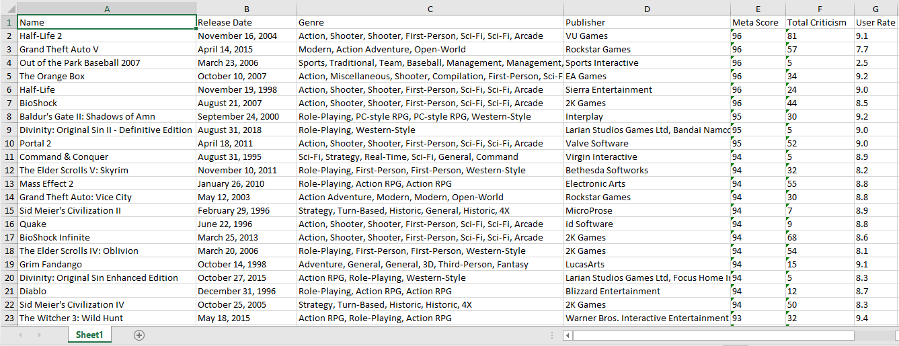

# basic-scraping-metacritic
A simple python scrapper to scrape game reviews from metacritic. Can be customised to scrape other data from metacritic as well.

Run scrap_links.py to get the list of all game url's which will be exported as .csv file, then run scrap_game_infos.py and after its done with scraping the .xlsx file that contains all of the game informations will be created.

<b>Sample</b>

